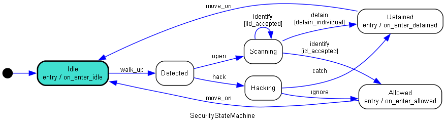

# LVS Security Application

## Overview
The system as a whole consists of the following modules:
 - security_manager.py
	- The starting point and application manager for the whole security system. It contains the cmd user interface `CommandUI` and manager `SecurityManager`. The CommandUI can show/hide the camera feeds, shut the system down, trigger events directly and run through the security state machine detailed below.
 - security_camera.py
	- The camera specific manager `CameraManager` that can handle multiple cameras and the camera objects themselves `Camera`
 - event_logger.py
	- Handles incoming event triggers and saves the event objects `Event` to the `EventHandler`. Additionally handles the reading and writing to the JSON file.
 - event_notifier.py
	- A subscriber/notifier design pattern used to send events across modules while allowing the objects to be decoupled from eachother.
 - security_states.py
	- A security specific state machine designed to simulate a generic security post, where specific actions generate the events. This is where the specified events are first 'notified' through the event notifier's subscribed functions and sent to the appropriate functions.
 - logging_handler.py
	- Another receiver of the event_notifier events, however these are for Error/Exception driven events. Based on the python loggin module, this allows for errors and warnings to be saved to errors.log and contain additional formatting
 - tests.py
	- Based on the python unittest module, tests for the state machine, event logging and camera captures are run. To run the tests, run `python tests.py`

## Running the system
To ensure the correct packages are installed run the following
```
pip install -r /path/to/requirements.txt
```
To begin the security application run the security manager. This assumes you have a webcam with the camera index at 0
```
python security_manager.py -c 0
```
__Navigating the state machine__  
The current state machine has the following layout:

The state begins at idle and through the cmd terminal the state machine can be navigted through. using the `sim` argument followed by a state machine action. The actions are the blue arrows and the states are the boxes.

Here is some example code, the allowable access codes are 42 and 50
```
Welcome to the LVS Security system. Type help or ? to list commands.

> sim walk_up
Action: walk_up
Moving from idle to detected
> sim open 41
Action: open
Moving from detected to scanning
> sim open 42
Action: open
Moving from scanning to scanning
> sim identify
Action: identify
Moving from scanning to allowed
```

Events are triggered on being detected, attempting to id, id successful, id unsuccessful, a person being allowed and a person being detained. These events only save to the events.json and create image captures, they do not notify in terminal.

## Documentation of AI Assistant Use
AI was used twice in the development of this application.  
The first was attempting to debug possible exception cases for when no cameras are present, any google results were unhelpful and using ChatGPT as a last resort yielded no outcomes.  
The second use was helpful, while working on the threaded camera viewing I noticed a bug where it was not actually swapping between tasks. Once again google was not helpful as I did not see the clear bug. I rewrote the appropriate section in ChatGPT to see what it could find and it correctly identified that I called the function instead of passing the callable version
```
# Wrong
thread = Thread(target=threaded_function())

# Correct
thread = Thread(target=threaded_function)
```